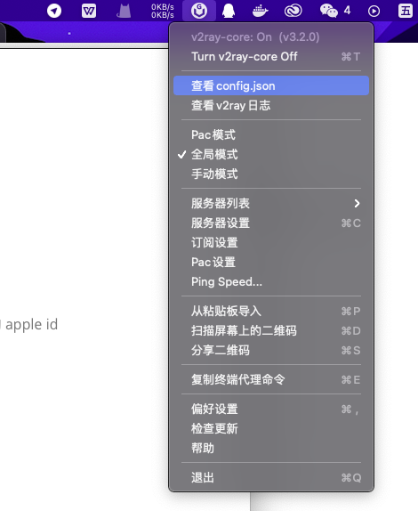
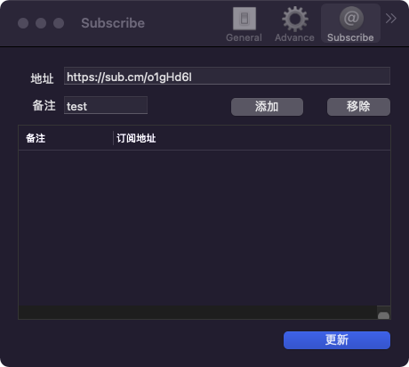
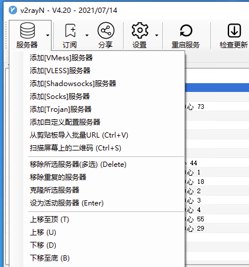
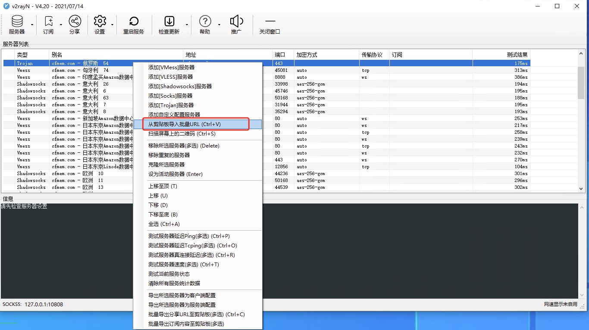
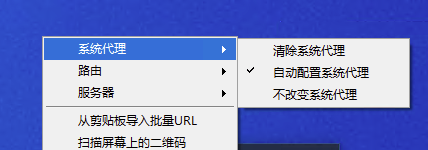
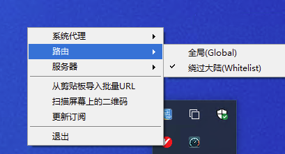

> 所有免费节点均取自互联网，请大家合理使用，切勿用于非法用途

### 客户端使用

#### IOS 

> ios 我用的是 OneClick **免费**使用，支持 `Shadowsocks`, `Trojan`, `Vmess`支持订阅，注册一个港区的 apple id 就可以

[OneClick 地址](https://oneclick.earth/#/)
[港区App ID 注册流程](https://oneclick.earth/help/appleid.html)

#### Mac 平台

[V2rayU下载地址](https://pd.zwc365.com/seturl/https://github.com/yanue/V2rayU/releases/download/3.2.0/V2rayU.dmg)

> 下载后双击安装并打开，如果提示不能打开试着执行 `sudo xattr -r -d com.apple.quarantine /Applications/V2rayU.app`

##### 图文教程

导入节点方法：

- 从粘贴板导入，也就是你复制好了链接后，可以直接点击**从粘贴板导入**

- 扫描屏幕上的二维码，也就是你打开了二维码图片，点击 **扫描屏幕上的二维码**就可以导入

- 订阅设置，点开订阅设置后，输入地址、备注，然后点添加，再点更新便可以完成订阅

  

- Pac 模式 也称自动模式，会自动选择哪些链接走协议，那些链接直连
- 全局模式 所有的链接都走协议（国内链接会慢）

#### Android

[客户端下载](https://pd.zwc365.com/seturl/https://github.com/2dust/v2rayNG/releases/download/1.6.15/v2rayNG_1.6.15_arm64-v8a.apk)

[使用教程](https://www.cfmem.com/2021/07/v2rayng.html)

#### windows 

[v2rayNG下载地址](https://pd.zwc365.com/seturl/https://github.com/2dust/v2rayN/releases/download/4.20/v2rayN-Core.zip)

导入节点的方法和 **V2rayU** 是一样的支持 `从剪贴板导入`、`扫描屏幕二维码`、`添加订阅`,当然你也可以手动添加

从剪贴板倒入可以批量导入，勾选节点复制后可以直接粘贴

点击右下角的图标，系统代理选择 `自动配置系统代理` 路由选择 `绕过大陆` 然后回主页面选择主要的节点 `设置为活动服务器`

#### 节点地址（更新时间 `2021-08-21`）

[节点地址](https://www.cfmem.com/2021/07/v2rayfree.html)

[视频教程](https://www.youtube.com/watch?v=odns9TAs4nQ)

订阅地址： `https://cdn.jsdelivr.net/gh/changfeng2021/free-v2ray-daily@master/sub`

> 完整订阅节点比较多时， 会卡。解决视频教程 `https://www.youtube.com/watch?v=CD-hi4mN36A` 
>
> 我的博客：`https://www.cfmem.com/2021/07/v2rayfree.html`

